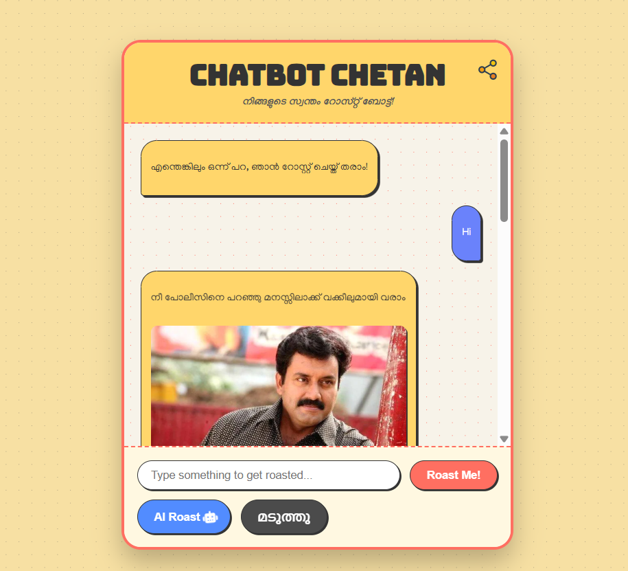
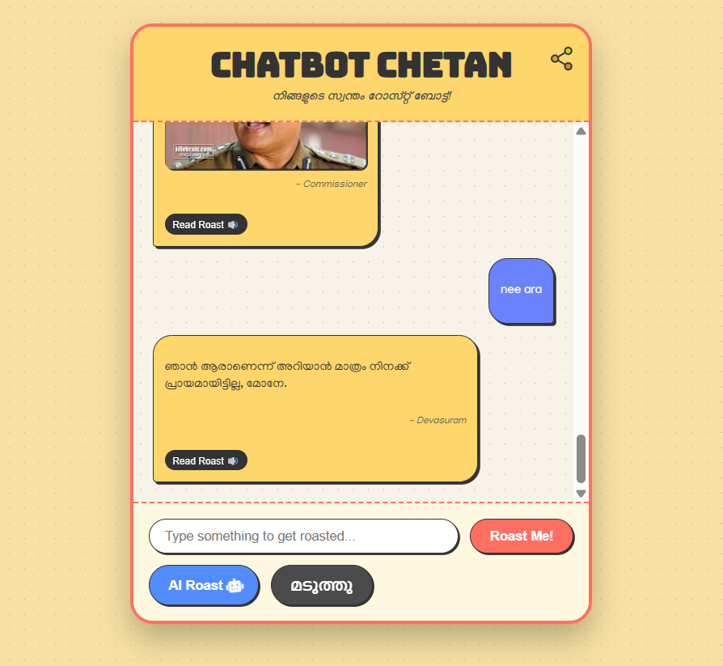

# 🤖 Chatbot Chetan
<br>
<p align="center">


</p>

## 🎭 About the Project
<br>
**Chatbot Chetan** is *not your average AI assistant*. It’s a sarcastic, humorous, and slightly savage chatbot that roasts your messages with iconic **Malayalam movie dialogues**. Always ready to roast, but make it fun.

On top of that, it features an **AI-powered roast mode** using Google API, along with a **Text-to-Audio framework** so it can make every roast hit harder.

### ✨ Core Features
<br>
- 💬 **Malayalam Movie Dialogue Roasts** – Responds to your messages with legendary Mollywood comebacks.
- 🤖 **AI Roast Mode** – Uses Google API to generate next-level burns.
- 🔊 **Text-to-Speech** – Lets you *hear* the roast for full dramatic effect.
- 🚀 **Lightweight & Fast** – Built with pure HTML, CSS, and JavaScript.
- 🎨 **Clean, Responsive UI** – Works smoothly on desktop and mobile.
- 🛠 **Easily Customizable** – Conversation logic is simple to tweak in `script.js`.

---

## 🛠 Tech Stack
<br>
- **HTML5** – Markup
- **CSS3** – Styling
- **JavaScript (ES6)** – Logic
- **Google API** – AI roast generation
- **Text-to-Speech Framework** – Roast delivery

---

## 👥 Team Contributions

| Name                 | Contributions         |
| -------------------- | --------------------- |
| **Adithyan N**       | Idea, Styling         |
| **Muhammed Nidal N** | JavaScript Logic, API |

---

## 🚀 Quick Start
<br>
```bash
# Clone the repo
git clone https://github.com/code-with-me-an/CHATBOT-CHETAN.git

# Navigate to the directory
cd CHATBOT-CHETAN

# Run the bot
# Just open index.html in your browser
```

---

## 📸 Demo Screenshots
<br>
**Home Page**

The welcoming screen of Chatbot Chetan.

**Roast Mode**

Classic Malayalam-style roast with static image and dialogues.

**AI Roast Mode**

AI-generated witty comebacks that make every reply hilarious.

---

## 🤝 Contributing
<br>
Contributions make the open-source community an amazing place to learn and create. Any contributions you make are greatly appreciated.

---

```bash
# Example workflow
# Fork the Project
# Create your Feature Branch 
git checkout -b feature/AmazingFeature
# Commit your Changes
git commit -m 'Add some AmazingFeature'
# Open a Pull Request
git push origin feature/AmazingFeature
```
---
## 📄 License
<br>
Distributed under the MIT License. See LICENSE for details.

---

## 💬 Final Note
<br>
"Ivide chat cheyyan vannal, roast edukkan ready aavuka."
🔥 Chatbot Chetan – Because sometimes, your messages deserve a Malayalam-style burn.

---

<p>
Project Link: <a href="https://code-with-me-an.github.io/CHATBOT-CHETAN/" target="_blank">Try chatbot chetan</a>
</p>


